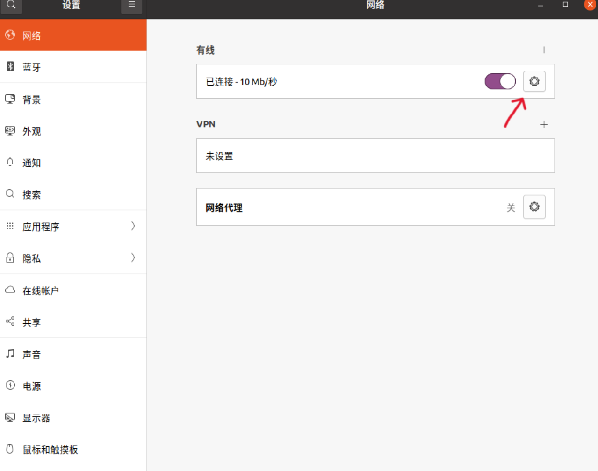
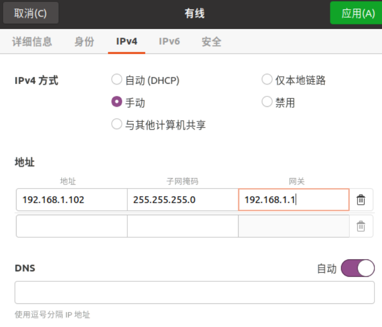

# FAST-LIO
这篇文章是用来安装FAST-LIO的教程

# 首先要判断你使用的是什么类型的雷达

对于下面这些种类的雷达，请选择安装Livox-SDK以及livox_ros_driver

    Tele-15
    Avia
    Mid-70
    Horizon

对于下面这些种类的雷达，请选择安装Livox-SDK2以及livox_ros_driver2

    HAP
    MID-360

下面以MID-360为例进行安装。


## 1 首先安装Livox SDK2
#### 1.1 简介
    Livox SDK2 是专为 HAP 和 Mid-360 等所有 Livox 激光雷达设计的软件开发套件。
    它基于C/C++开发，遵循Livox SDK2通信协议，提供简单易用的C式API。通过 Livox SDK2，用户可以快速连接 Livox 激光雷达并接收点云数据。
    Livox SDK2 由 Livox SDK2 核心代码、Livox SDK2 API 和三个示例组成。

#### 1.2 依赖关系
    CMake 3.0.0+
    gcc 4.8.1+
#### 1.3 没有cmake的话
    sudo apt install cmake
#### 1.4 编译和安装

    $ cd ./Livox-SDK2/
    $ mkdir build
    $ cd build
    $ cmake .. && make -j
    $ sudo make install


## 2 接下来安装livox_ros_driver2

#### 2.1 执行下面的语句的其中一个（选符合你的ros版本的）

For ROS (take Noetic as an example):

    source /opt/ros/noetic/setup.sh
    ./build.sh ROS1

For ROS2 Foxy:

    source /opt/ros/humble/setup.sh
    ./build.sh humble

For ROS2 Humble:

    source /opt/ros/humble/setup.sh
    ./build.sh humble

#### 2.2 然后接入雷达数据（实时的真雷达数据）run一下看看

For ROS:

    source ../../devel/setup.sh
    roslaunch livox_ros_driver2 [launch file]

livox_ros_driver2 : 是 Livox ROS driver 2 的 ROS 软件包名称;

[launch file] : 要使用的ROS启动文件;“launch_ROS1”文件夹包含多个启动示例供您参考;

    roslaunch livox_ros_driver2 rviz_HAP.launch

For ROS2:

    source ../../install/setup.sh
    ros2 launch livox_ros_driver2 [launch file]

[launch file] : the 'launch_ROS2' “launch_ROS2”文件夹包含多个启动示例供您参考;:

    ros2 launch livox_ros_driver2 rviz_HAP_launch.py

#### 2.3 启动文件并livox_ros_driver2内部参数配置说明

详见https://github.com/Livox-SDK/livox_ros_driver2#for-ros2-foxy


#### 2.4 Ubuntu连接激光雷达

2.4.1 Ubuntu设置静态IP



点击【IPv4】，设置静态IP。



点击应用就设置完成了，需要重启ubuntu才能生效。

重启完成后静态IP就设置成功了。

2.4.2 修改配置文件

我是用的是MID360,因此需要修改```src/livox_ros_driver2/config/MID360_config.json```

对应于不同的雷达，需要修改不同的json文件，如果是HAP/MID_360的是需要修改livox_ros_driver2中的。
对于其他的雷达类型，则是需要修改livox_ros_driver中的，具体请见上方支持的雷达的类型

修改host里面的ip为刚刚设置好的静态ip，
同时需要修改lidar的ip为雷达的ip，其中雷达IP 192.168.1.1XX，后两位为雷达S/N码（可以在雷达包装盒和雷达二维码下面找到）的最后两位。


2.4.3 测试

    suorce ../../devel/setup.sh
    roslaunch livox_ros_driver2 msg_MID360.launch


## 3 最后安装Fastlio

#### 3.1 依赖

3.1.1 Ubuntu and ROS

    Ubuntu >= 18.04.

    ROS >= Melodic. ROS Installation

3.1.2 PCL && Eigen && openCV

    PCL >= 1.8, Follow PCL Installation.

    Eigen >= 3.3.4, Follow Eigen Installation.

    OpenCV >= 3.2, Follow openCV Installation.

3.1.3 [livox_SDK livox_ros_driver ]or livox_SDK2  livox_ros_drvier2 (上面的安装步骤)

    Follow livox_ros_driver2 Installation.

#### 3.2 安装

在src界面下执行下面的命令
    
    catkin_make
    source devel/setup.bash

#### 3.3 执行

一个重要的提醒：

A. **请确保IMU和LIDAR是同步的**

B. **Warning message “Failed to find match for field 'time'”表示rosbag文件中缺少每个激光雷达点的时间戳。这对于正向传播和反向传播是重要的。**

C. **如果给出了外部因素，我们建议将extrinsic_est_en设置为 false。关于外在初始化，请参考我们最近的工作:https://github.com/hku-mars/LiDAR_IMU_Init**

对于MID_360来说：

    roslaunch livox_ros_driver2 msg_MID360.launch
    roslaunch fast_lio_with_map mapping_avia.launch

#### 3.4 pcd保存

把```pcd_save_enable```设为1，所有扫描（全局帧）将被累积并保存到文件FAST_LIO_with_map/PCD/scans.pcd中， FAST-LIO终止后可以可视化点云。
